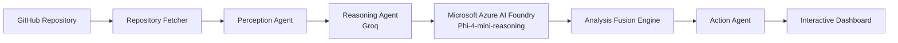

# 🚀 GitAtlas

<div align="center">

### AI-Powered Multi-Agent Repository Intelligence Layer


GitAtlas serves as the intelligence layer for modern software engineering. Simply provide a GitHub repository URL, and specialized AI agents collaborate to understand architecture, assess security, generate documentation, draft pull requests, compare repositories, answer developer questions, and recommend improvements—all from a single intelligent workspace powered by **Groq** and **Microsoft Azure AI Foundry**.

<br>


</div>

---

## 🎥 Demo

> Watch GitAtlas orchestrate multiple AI agents to analyze, understand and improve GitHub repositories.

- 📺 **Demo Video:** 

https://github.com/user-attachments/assets/aa4b13df-6fc1-4441-bb2f-143e3ec7933b


---

# 📸 Interface Preview

## 🏠 Dashboard


## 🚀 Get Started


## 💬 AI Repository Chat


## 🔒 Security Findings


## 📚 AI Documentation Generation


## 📝 AI Pull Request Draft


## ⚖ Repository Comparison


## 💡 Engineering Recommendations


## 🔄 Modernization Plan


## ⚙ Live Agent Pipeline


---

## 🌟 Overview

GitAtlas is an AI-powered repository intelligence platform that transforms any public GitHub repository into a comprehensive architectural report within seconds.

Unlike traditional repository analysis tools, GitAtlas acts as an **Agentic AI Software Engineering Platform** where specialized AI agents collaborate to understand, analyze, secure, document, compare, and improve software repositories from a single intelligent workspace.

Using a collaborative **Multi-Agent AI Architecture**, GitAtlas analyzes software architecture, detects security risks, measures complexity, generates documentation, drafts pull requests, compares repositories, and provides actionable engineering recommendations.

To improve reliability, GitAtlas uses **Microsoft Azure AI Foundry (Phi-4-mini-reasoning)** as an independent validation layer that verifies and strengthens the primary analysis generated by the Groq Reasoning Agent.

---

## ✨ Features

- 🧠 Multi-Agent Repository Analysis
- 🏛 Automatic Architecture Detection
- ☁ Microsoft Azure AI Foundry Validation
- 🔒 Security & Risk Assessment
- 📊 Complexity Analysis
- 📚 AI Documentation Generation
- 💬 Repository Chat Assistant
- 📝 AI Pull Request Generator
- ⚖ Repository Comparison
- 🚀 Engineering Recommendations
- ⚡ Real-Time SSE Streaming

---

## 🏗 System Architecture


---

## 🤖 AI Workflow



---

## ☁ Microsoft Azure AI Foundry

GitAtlas leverages **Microsoft Azure AI Foundry** with **Azure OpenAI Phi-4-mini-reasoning** as an independent reasoning and validation layer.

The Groq Reasoning Agent performs the primary repository analysis, while Phi-4 independently validates architectural decisions, security findings, and confidence scores. Both outputs are merged through the **Analysis Fusion Engine** to deliver more reliable and explainable repository intelligence.

---

## 🛠 Tech Stack

| Category | Technologies |
|-----------|--------------|
| **Backend** | Python, FastAPI, Uvicorn |
| **AI** | Groq, Llama Models, Microsoft Azure AI Foundry, Azure OpenAI, Phi-4-mini-reasoning |
| **Frontend** | HTML, CSS, JavaScript |
| **APIs** | GitHub REST API, GitHub Models |
| **Visualization** | NetworkX, Matplotlib |

---

## ⚙ Installation

```bash
git clone https://github.com/priyamanna13/GitAtlas-Hackathon.git

cd GitAtlas

python -m venv venv

venv\Scripts\activate

pip install -r requirements.txt
```

---

## 🔑 Environment Variables

```env
GROQ_API_KEY=
GITHUB_TOKEN=
AZURE_OPENAI_ENDPOINT=
AZURE_OPENAI_API_KEY=
AZURE_OPENAI_API_VERSION=
AZURE_OPENAI_DEPLOYMENT=
```

---

## ▶️ Run

```bash
python server.py
```

Open:

```
http://localhost:8000
```

---

## 📡 API Endpoints

| Method | Endpoint | Description |
|--------|----------|-------------|
| GET | `/api/analyze` | Analyze Repository |
| POST | `/api/chat` | Repository Chat |
| POST | `/api/docs` | Generate Documentation |
| POST | `/api/pr` | Generate Pull Request |
| POST | `/api/compare` | Compare Repositories |
| GET | `/api/health` | Health Check |

---

## 🛡 Reliability

GitAtlas is designed for resilient AI workflows through:

- Independent Azure AI validation
- Consensus-based reasoning
- Graceful fallback mechanisms
- Retry logic for external AI providers
- Real-time streaming updates using SSE

---

## 🚀 Future Roadmap

- AI Code Review Agent
- GitHub Pull Request Creation
- VS Code Extension
- Docker Deployment
- Enterprise Repository Analytics
- CI/CD Integration

---

## 👥 Team

- **Priya Manna**
- **Ashish Maurya**
- **Adarsh Maurya**

---

## 📄 License

MIT License

---

<div align="center">

### ⭐ If you like GitAtlas, consider giving it a star!

Built with ❤️ for the Microsoft AI Agents League Hackathon.

</div>
